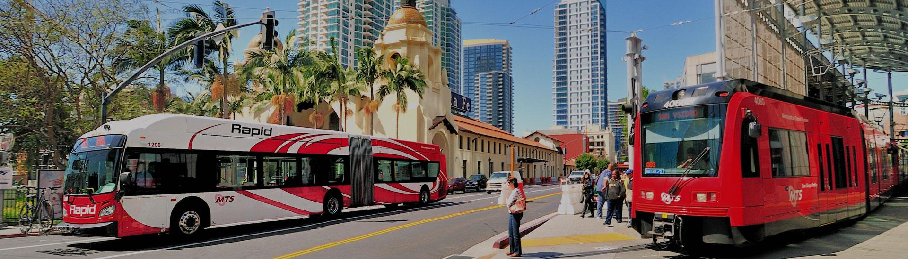

<div style="text-align: center"> ECE143 Group 3 Project </div> 


# Effectiveness of Public Transportation

Spring 2019 @ UCSD

##Description
---
Public transportation is an economical and eco-friendly way to travel. More cities should be investing in public transport infrastructure.

This project tries to analyse:

* Annual ridership trends of public transportation.
* Fuel savings due to usage of public transport.
* Correlation between public transport ridership and road accidents.
* Correlation between public transport ridership and car sales.
* US county level public transport vehicle availability.

##Requirements/Dependencies
---
```
import time
import os
import collections
import numpy as np
import pandas as pd
import seaborn as sns
import matplotlib.pyplot as plt
import string
from bokeh.plotting import figure, show, output_file
from bokeh.sampledata.us_counties import data as counties
from bokeh.sampledata.us_states import data as states
from bokeh.palettes import Reds as palette
from bokeh.layouts import column, row, widgetbox
from bokeh.models import CustomJS, Slider, Toggle
from bokeh.models.callbacks import CustomJS
from bokeh.io import show, output_file
from bokeh.models import ColumnDataSource, HoverTool, LogColorMapper
from datetime import datetime
import plotly
import plotly.graph_objs as go
import plotly.tools as tls
import matplotlib.lines as mlines
```

##Code Organization
---

##Plots
---
###US Annual Trends
* [Ridership](http://acsweb.ucsd.edu/~rokumar/ridership_from_1922_rajat.html)
* [Revenue Miles](http://acsweb.ucsd.edu/~rokumar/miles_rajat_final.html)
* [Employees](http://acsweb.ucsd.edu/~rokumar/employee_compensation_us_rajat.html)
* [Fuel Savings](http://acsweb.ucsd.edu/~rokumar/employee_compensation_us_rajat.html)
####Correlation
* [Ridership vs Motor Vehicle Accident Deaths](http://acsweb.ucsd.edu/~rokumar/corrTvD.jpg)
* [Ridership vs Personal Motor Vehicle Sales](http://acsweb.ucsd.edu/~rokumar/corrTvT.jpg)

##Project by:
---
i) Himanshu Gupta

ii) Mingkun Yin

iii) Rajat Sethi

iv) Rohit Kumar

[Project Presentation](https://drive.google.com/a/eng.ucsd.edu/file/d/1Bk8idTlstwerVcrGewY6Z3Pjgp48-w7_/view?usp=sharing)
---
[Project Proposal](https://drive.google.com/open?id=1tMI7DCHLvUNBs6RAQkT9LqQ2Diw3NZZU)
---
